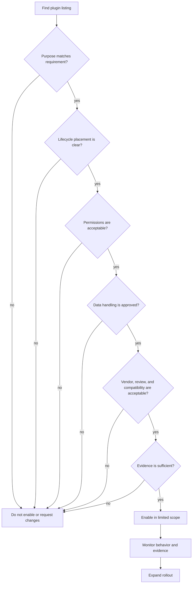
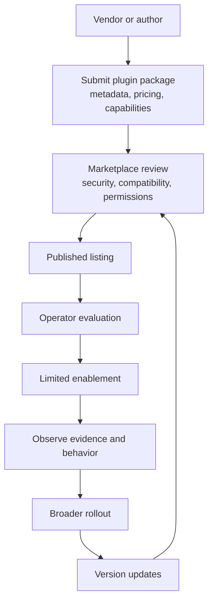

# Marketplace

The Odock Plugin Marketplace is coming soon.

The current Odock runtime already has a modular plugin engine for request-aware, response-aware, and evidence-aware behavior. Today, custom plugins are reviewed and delivered with the Odock team because they can participate in sensitive gateway lifecycle moments. For the current process, see [Request A Custom Plugin](/docs/plugins/request-custom-plugin).

The marketplace is the next product layer on top of that engine. It is intended to let teams discover plugins, evaluate trust and permissions, and eventually let vendors and builders publish and sell plugins in a governed catalog.

## The Marketplace Concept

The marketplace will be the discovery, review, distribution, and commercial layer for packaged Odock plugins.

It is not just a public list of integrations. A plugin may affect runtime LLM or MCP behavior, send selected data to external systems, add headers, block traffic, transform metadata, emit evidence, call webhooks, send email, or run analytics. Because of that, marketplace plugins must be understandable before they are enabled.

The goal is to support a plugin ecosystem where:

- builders can publish plugins for common enterprise AI workflows
- vendors can sell supported plugins
- operators can understand exactly what a plugin does
- security teams can review permissions, data movement, and lifecycle placement
- Odock deployments can enable plugins without rewriting application code
- private and enterprise plugins can remain available only to approved deployments

## Why It Exists

- enterprises use different SIEM, DLP, approval, ticketing, and identity systems
- teams need different audit export formats
- regulated deployments need custom evidence
- customer-facing products may need recommendation, analytics, or notification workflows
- MCP-enabled agents may need tool-specific enterprise controls
- product teams may want conversation-aware workflows such as ad recommendations, special-word analytics, enrichment, or internal recommendation systems

Rather than putting every custom behavior into the core product, Odock uses plugins as governed extension points.

## Current Availability

The Plugin Marketplace is not yet available as a self-service catalog.

Today:

- the modular plugin engine exists in the Odock gateway
- custom plugins can be requested through the Odock team
- private plugin work requires design review, security review, and deployment-specific setup
- public publishing, selling, marketplace installation, and self-service enablement are planned future capabilities

If you need a plugin now, use [Request A Custom Plugin](/docs/plugins/request-custom-plugin).

## Future Discovery

When the marketplace is available, operators should be able to discover plugins by category, purpose, lifecycle moment, supported resource, vendor, compatibility, and required capabilities.

Common marketplace categories:

- Audit and compliance
- Security and DLP
- Approval workflows
- Request enrichment
- Response processing
- Webhooks and notifications
- Analytics and warehouse export
- Recommendation and business workflow
- MCP and tool governance
- Enterprise policy integrations
- Commercial and monetized plugins
- Private enterprise listings

## Future Publishing And Selling

The marketplace is intended to support publishing and selling plugins, not only installing first-party extensions.

The future publishing model should let a plugin author provide:

- plugin name, vendor, author, and support contact
- category and pricing model
- purpose and target use cases
- lifecycle moments used
- required capabilities and permissions
- supported Odock versions and deployment types
- configuration requirements
- security notes and data handling behavior
- observability produced
- version history and release notes
- review status and compatibility notes

Paid plugins should make commercial ownership clear. Operators should know who supports the plugin, what version is installed, what terms apply, and how updates are reviewed before rollout.

## Marketplace Metadata

A marketplace listing should communicate the following before any deployment enables the plugin.

| Metadata | What operators should learn |
| --- | --- |
| Category | The problem area, such as audit, DLP, analytics, approval, or enrichment. |
| Purpose | A short explanation of what the plugin does and when to use it. |
| Lifecycle moments used | Whether it runs before upstream work, after upstream response, or after response/evidence. |
| Required capabilities | Whether it can observe, block, mutate, send network calls, use secrets, or run background work. |
| Supported resources | Whether it applies to models, MCP servers, API keys, teams, tenants, or organisations. |
| Configuration requirements | Required fields, credentials, endpoints, templates, allowlists, or review steps. |
| Security notes | Data leaving Odock, sensitive fields used, permission boundaries, and known limitations. |
| Observability produced | Usage evidence, audit events, metrics, logs, traces, webhook delivery records, or export ids. |
| Vendor/author | Who maintains the plugin and who to contact for support. |
| Compatibility | Supported Odock versions, plugin contract version, deployment types, and dependencies. |

## Plugin Types

Odock plugin distribution should distinguish the source and trust model.

| Type | Status | Source | Typical use |
| --- | --- | --- | --- |
| Built-in plugins | Product-managed | Odock first-party distribution | Standard packaged behavior and supported extension examples. |
| Marketplace plugins | Coming soon | Public or partner marketplace listing | Reusable integrations, commercial plugins, and published workflows. |
| Private/internal plugins | Available by deployment review | Your organisation, private vendor, or Odock-assisted delivery | Proprietary DLP, policy, audit, analytics, approval, webhook, email, or recommendation workflows. |
| Custom-developed plugins | Available by request | Designed with Odock for a specific requirement | New behavior that needs design, implementation, security review, and rollout planning. |

Private and custom plugins are the current path for most non-standard behavior. Marketplace plugins will become the self-service discovery and distribution path once the marketplace is released.

## Future Marketplace Evaluation

Before enabling any future marketplace plugin, operators should review the same questions Odock reviews for custom plugins:

- What problem does the plugin solve?
- Which lifecycle moments does it use?
- Can it block, transform, enrich, export, notify, or only observe?
- Does request or response data leave Odock?
- What external systems does it call?
- What capabilities, secrets, or scopes does it require?
- Which models, MCP servers, API keys, teams, tenants, or organisations can it affect?
- What usage evidence, logs, metrics, traces, audit events, or delivery records does it produce?
- Is it compatible with the deployment?
- Who supports the plugin and its updates?

## Marketplace Governance

Marketplace governance focuses on:

- trust: who authored the plugin and how it is reviewed
- permission awareness: what the plugin can observe, mutate, block, or send externally
- compatibility: which Odock versions and deployment shapes it supports
- operational evidence: what operators can verify after enablement
- versioning: how updates are reviewed, rolled out, and rolled back
- rollout strategy: how to start narrow before broad deployment

## What Operators Should Monitor

For any plugin enabled through the future marketplace, operators should verify:

| Signal | What it tells you |
| --- | --- |
| Usage record | Request status, model or MCP server, cost, latency, API key, and request id. |
| Plugin decision evidence | Whether the plugin allowed, blocked, transformed, recorded, emitted, or failed. |
| Logs | Operational details and error messages. |
| Metrics | Counts, error rates, latency, timeouts, and decision rates. |
| Traces | Where plugin work occurred in the request path and how long it took. |
| Audit export | Durable compliance or governance records. |
| External delivery records | Webhook, email, SIEM, DLP, approval, analytics, or recommendation delivery status. |

For general usage records, see [Usage Monitoring](/docs/observability/usage-records). For logs, metrics, and traces, see [LGTM Stack](/docs/observability/lgtm-stack).

## When To Contact Odock

Contact the Odock team when:

- you need a plugin before the marketplace is available
- the plugin requires private deployment setup
- the plugin needs access to enterprise secrets or sensitive data flows
- the plugin must integrate with internal approval, DLP, SIEM, identity, or analytics systems
- you want to publish or sell a plugin when marketplace publishing becomes available
- you need a custom plugin or private marketplace listing
- rollout requires assistance with evidence, testing, or operational review
