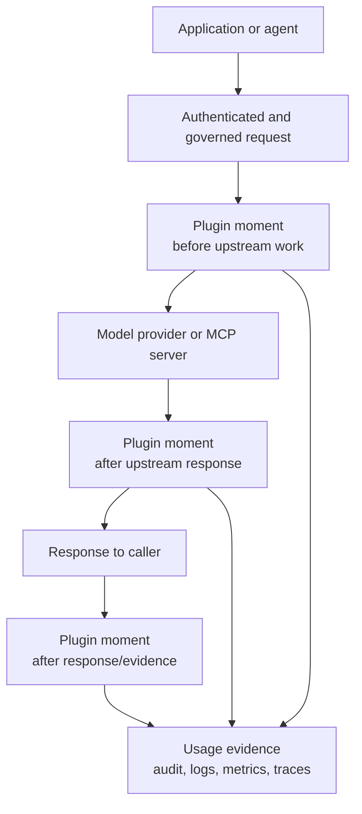
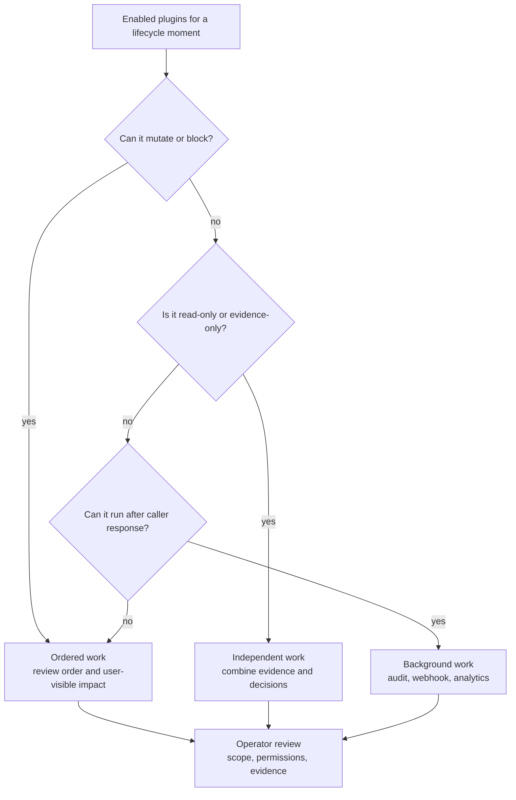
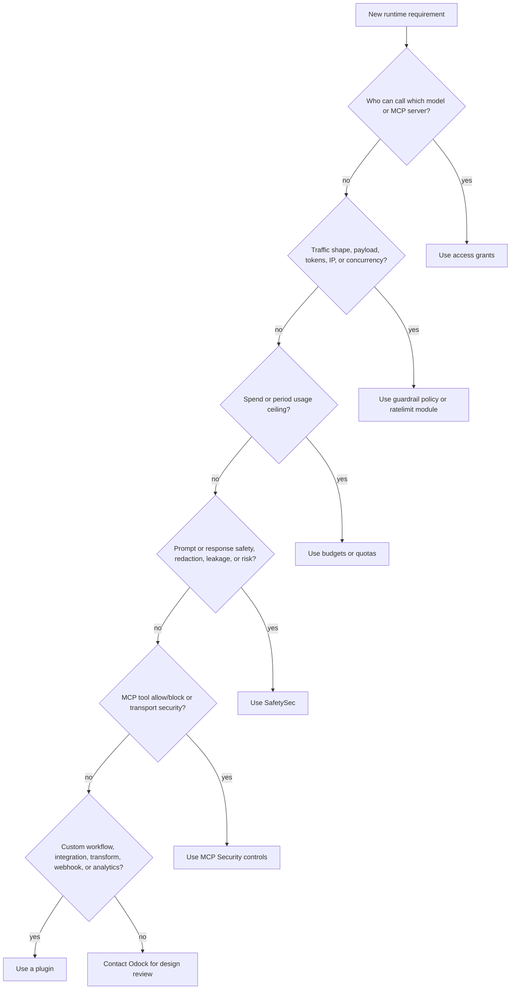

# Plugin Lifecycle

Plugins participate in the request lifecycle at moments where their required context exists. Odock does not publish the exact private phase order, internal contracts, queue behavior, or source wiring. The public model is enough for operators to reason about behavior, rollout, and evidence.

## Lifecycle Moments

The names above are conceptual. Your deployment may include additional gateway work around these moments, such as authentication, access grants, policies, SafetySec, budgets, quotas, routing, usage recording, and reconciliation.

## Before Upstream Work

Use this moment when the plugin needs to act before content or metadata leaves Odock for a provider or MCP server.

Common examples:

- request enrichment with tenant, project, billing, or trace metadata
- custom headers for approved upstream integrations
- tenant-specific eligibility checks
- proprietary DLP checks before egress
- custom approval workflow before sensitive model use
- route-specific webhook calls that must complete before upstream work

Possible outcomes:

- allow the request unchanged
- add metadata or headers
- transform approved request fields
- block with a user-visible reason
- emit request-side evidence

Do not place a plugin here if it needs the model response. It does not exist yet.

## After Upstream Response

Use this moment when the plugin needs the response from the model provider or MCP server before deciding what to do.

Common examples:

- response DLP or classification integration
- response metadata enrichment
- post-response policy evidence before the caller sees the response
- custom response transformation for a specific tenant or tool
- analytics signals that depend on output status or content

Possible outcomes:

- allow the response unchanged
- transform approved response fields
- block or replace the response when configured to enforce
- emit response-aware evidence

Use [SafetySec](/docs/security-and-guardrails/safetysec-engine) rather than a plugin when the requirement is primarily prompt safety, response safety, redaction, leakage prevention, or repeated-risk behavior.

## After Response Or Evidence Stage

Use this moment when work should not delay the caller response or cannot change the result.

Common examples:

- audit export
- SIEM forwarding
- webhook delivery
- email notifications
- analytics warehouse export
- request id correlation
- post-response recommendation signals
- detection of special words or business events for reporting

This is the right place for background work when the plugin only records, exports, or analyzes. It should not be used for enforcement that callers expect to stop a request.

## Ordered, Independent, And Background Work

Ordered work is used when a plugin may change state, transform content, or stop the request. Independent work is used when plugins can observe and emit evidence without depending on each other. Background work is used for follow-up side effects such as audit export, webhooks, email, or analytics.

The operator-facing question is always the same: can this plugin change what the caller receives, or does it only record and export evidence?

## Decision Tree

## Evidence Expectations

A plugin should leave enough evidence for an operator to answer:

- request id
- plugin name or display name
- lifecycle moment used
- action taken
- user-visible result, if any
- scope: organisation, team, API key, model, MCP server, or tenant
- external system called, if applicable
- whether the plugin changed request or response data
- whether the plugin ran in the response path or background

For current custom plugin delivery, see [Request A Custom Plugin](/docs/plugins/request-custom-plugin). For the planned self-service ecosystem, see [Marketplace](/docs/plugins/marketplace).
