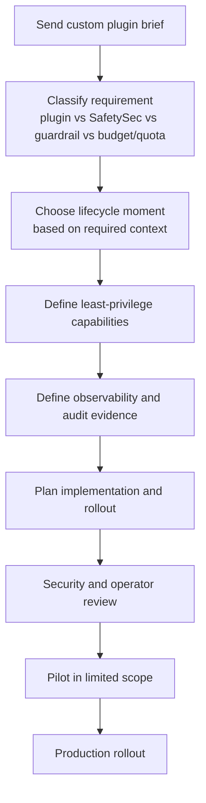

# Request A Custom Plugin

Request a custom plugin when you need deployment-specific workflow, integration, transformation, or evidence behavior that is not part of standard Odock controls.

The Odock gateway already includes a modular plugin engine. The self-service Plugin Marketplace is still coming soon, so custom plugins are currently requested through the Odock team. This lets Odock review lifecycle placement, least-privilege capabilities, user-visible behavior, observability, security, and deployment setup before a plugin is enabled.

This page is for users and operators. It does not provide internal implementation contracts, source-code paths, private interfaces, storage wiring, queue or worker internals, or admin-only secrets. Odock will provide the full implementation path for approved custom work.

## Current Model

Today:

- the modular plugin engine exists in the Odock gateway
- plugins can participate in request-aware, response-aware, and evidence-aware lifecycle moments
- plugin work can include webhooks, email, external tools, enterprise policy systems, audit export, DLP, analytics, recommendation workflows, and metadata enrichment
- custom plugin requests go through the Odock team
- Odock helps decide whether the requirement belongs in plugins, SafetySec, guardrails, budgets, quotas, access grants, or MCP security
- implementation details remain deployment-managed and are not published in public documentation

The future [Plugin Marketplace](/docs/plugins/marketplace) is intended to make discovery, publishing, selling, review, and self-service enablement possible. Until that is available, use this request process.

## Good Custom Plugin Candidates

Custom plugins are a good fit for:

- audit export to a proprietary archive or SIEM
- request enrichment with tenant, project, billing, or classification metadata
- tenant-specific eligibility checks
- custom approval workflows
- proprietary DLP integrations
- custom headers or metadata enrichment
- enterprise policy integrations
- post-response analytics
- webhooks and email notifications
- recommendation workflows based on conversation context
- detection of special words or business events for analytics
- private MCP workflow governance

If the requirement is prompt or response safety, start with [SafetySec](/docs/security-and-guardrails/safetysec-engine). If it is traffic shape, start with [Guardrails](/docs/security-and-guardrails/guardrails). If it is cost or usage, start with [Budgets](/docs/management/budgets) or [Quotas](/docs/management/quotas).

## What To Send Odock

Send a concise design brief with:

| Information | What to include |
| --- | --- |
| Goal | One sentence describing what the plugin should do. |
| Traffic type | Model traffic, MCP traffic, or both. |
| Lifecycle moment | Before upstream work, after upstream response, after response/evidence, or unsure. |
| Scope | Organisation, team, tenant, API key, model, MCP server, or route. |
| Action model | Observe, allow, block, transform, enrich, export, notify, or analyze. |
| External systems | DLP, SIEM, approval, email, webhook, analytics, policy, recommendation, or other systems. |
| Data fields | The minimum request, response, metadata, usage, or identity fields needed. |
| User-visible behavior | What the caller or operator should see when the plugin acts. |
| Evidence | Logs, metrics, traces, usage evidence, audit events, delivery ids, or reports required. |
| Rollout plan | Test scope, observe-only needs, production timeline, and rollback expectations. |
| Compliance constraints | Data residency, retention, encryption, vendor review, or legal requirements. |

Do not send admin-only secrets in the initial request. Odock will provide an approved secret exchange and deployment setup process when needed.

## Design Review Flow

## Questions Odock Will Ask

Expect questions such as:

- Should the plugin ever block a request?
- Can it start in observe-only mode?
- Does it need prompt content, response content, or only metadata?
- Does any data leave Odock?
- Which external systems must be called?
- Are there latency requirements?
- What happens if the external system is unavailable?
- Which scopes should be supported?
- What evidence is required for audit or incident review?
- Who owns ongoing operation after rollout?

These questions protect the deployment. They keep custom behavior modular, observable, and least-privileged.

## Implementation Boundary

Odock will handle private implementation details for approved custom plugins, including the appropriate internal contract, deployment-specific configuration, testing strategy, security review, and rollout path.

Public documentation will not describe:

- internal plugin interfaces
- gateway source-code paths
- storage access wiring
- private queue or worker behavior
- secret handling internals
- admin-only configuration
- proprietary extension contracts

When those details are required, contact the Odock team.

## Acceptance Checklist

Before production rollout, confirm:

- the requirement is correctly classified as a plugin
- least-privilege capabilities are documented
- lifecycle placement is explained in operator terms
- user-visible behavior is stable
- request ids correlate with plugin evidence
- external integrations are tested
- failure behavior is understood
- rollout starts with limited scope
- rollback is documented
- operational ownership is assigned
