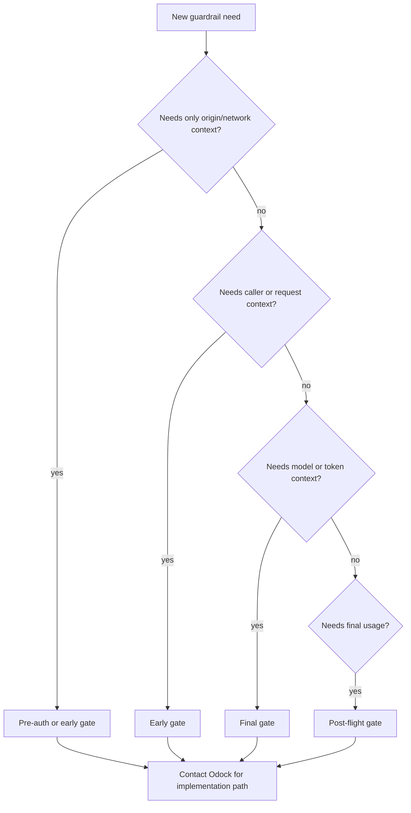

# Custom Guardrails

Custom guardrails let an organisation extend Odock's ratelimit and policy engine when the built-in policy fields are not enough.

This page explains the public development process for a new **ratelimit-style module**. It intentionally avoids internal code paths, private wiring details, and exact implementation contracts. If you need to build one for production, contact the Odock team so we can provide the full implementation path for your deployment.

Use this path when the new guardrail is:

- **network-aware**: it depends on origin, allowlists, blocklists, CIDR ranges, or traffic source
- **request-aware**: it depends on request count, payload size, burst behavior, concurrency, route, model, MCP server, or API key scope
- **token-aware**: it depends on requested output size, token envelope, token rate, model class, or post-call token usage

If the guardrail inspects prompt meaning or response safety, use the [Security Engine](/docs/security-and-guardrails/safetysec-engine). If it needs business workflow, third-party approval, custom transformation, or audit export outside ratelimit semantics, discuss a plugin-based extension with the Odock team.

## Design Philosophy

A ratelimit module should answer one narrow question.

Good questions:

- Is this source allowed to send traffic?
- Is this key sending too many requests?
- Is this model receiving too much burst traffic?
- Is this workload using too much concurrent capacity?
- Is this request asking for too large a token envelope?
- Does the final usage need to update a previously made runtime decision?

Poor questions:

- Can this module own the entire request lifecycle?
- Can this module decide model access, budgets, safety, and response behavior at once?
- Can this module inspect prompts and rewrite provider payloads?
- Can this module become a generic business workflow engine?

The philosophy is separation of concerns. Ratelimit modules protect traffic shape and runtime capacity. Access grants protect resource authorization. Budgets and quotas protect cost and period usage. Safety modules protect prompt and response content. Plugins handle custom deployment workflows.

## Step 1: Classify The Need

Start by writing the guardrail in one sentence:

```txt
Block or shape traffic when <scope> does <condition> during <lifecycle moment>.
```

Examples:

| Requirement | Classification |
| --- | --- |
| Block requests from untrusted networks. | Network-aware |
| Limit one API key to a custom burst profile. | Request-aware |
| Limit concurrent calls to a slow MCP server. | Request-aware |
| Enforce a token envelope for expensive model traffic. | Token-aware |
| Reconcile final token usage after a streamed response. | Token-aware, post-call accounting |

If the sentence mentions prompt intent, jailbreak behavior, data leakage, or response sensitivity, it belongs in the Security Engine rather than in a ratelimit module.

## Step 2: Choose The Gate

Choose the gate by asking what context the module needs.

| Needed context | Best gate family | Reason |
| --- | --- | --- |
| Origin or network only | Pre-auth or early gate | The decision can happen before expensive work. |
| Authenticated caller, API key, route, request size, model, or MCP server | Early gate | The module can protect request pressure before upstream work. |
| Requested model and token envelope | Final gate | The module needs decoded request and token context. |
| Actual usage after the call | Post-flight gate | The module needs completion or usage evidence. |

Do not choose an earlier gate just to block faster. The correct gate is the earliest point where the module has enough reliable context to make the decision.



## Step 3: Define The Policy Surface

A guardrail that users operate should have a clear policy surface.

Define:

- the policy field name
- the unit, such as requests, bytes, concurrent calls, tokens, or seconds
- the scope, such as organisation, team, API key, model, or MCP server
- whether `0` or empty means disabled
- the user-visible behavior when the limit is exceeded
- whether the limit should support shadow or observation mode
- how users will verify the result in usage, logs, or dashboards

Avoid creating a hidden guardrail that only exists in server code. If an organisation user must understand or tune it, it needs to be visible and documented.

## Step 4: Define The Module Behavior

Before implementation, define the module as a behavior contract in product terms.

The module should specify:

- what input context it needs
- what policy value it reads
- what runtime state it may create
- what counts as allow
- what counts as deny
- whether retry guidance is useful
- whether it needs post-flight cleanup or reconciliation
- what evidence it should emit

For example:

```txt
For each matching API key scope, compare the current in-flight workload
against the configured limit. Allow when capacity remains. Deny when the
scope is saturated. Release capacity after the request completes.
```

That description is enough for design review. The Odock team can then map it to the correct internal primitive and gate implementation.

## Step 5: Plan Runtime Evidence

A custom guardrail is not complete unless operators can understand it.

Plan:

- a stable reason name
- a user-facing error message
- the scope shown in logs or usage evidence
- whether a retry hint makes sense
- metrics or counters that should move when the guardrail fires
- how to distinguish an expected policy denial from an operational failure

This matters because ratelimits are operational controls. Teams need to know whether traffic was blocked because the policy worked, because a service failed, or because the request was malformed.

## Step 6: Plan Tests And Rollout

Before production rollout, validate:

- disabled policy means no enforcement
- allowed requests continue
- denied requests produce a stable reason
- scoped policies behave as expected
- shadow or observation mode behaves as expected, if supported
- cleanup or post-call accounting works after success, failure, and cancellation
- usage and logs give enough evidence for operators

Roll out narrow first:

1. Use one organisation or one API key.
2. Use conservative limits.
3. Observe before hard-blocking when possible.
4. Review usage and operational evidence.
5. Expand to broader scopes only after behavior is understood.

## When To Contact Odock

Contact the Odock team when:

- the guardrail needs a new ratelimit module
- the guardrail needs a new policy field
- the guardrail needs token-aware or post-flight accounting
- the guardrail needs to run at more than one gate
- the guardrail must support shadow mode, retry hints, or custom observability
- you are unsure whether the requirement belongs in ratelimits, SafetySec, budgets, quotas, access grants, or plugins

For special needs, send us:

- the one-sentence guardrail requirement
- the scope where it should apply
- the unit and limit semantics
- examples of allowed and denied traffic
- expected user-visible error behavior
- rollout expectations, such as observe first or block immediately

We will provide the full implementation path for your deployment, including the internal module shape, policy wiring, gate injection, tests, and operational rollout plan.

## Rule Of Thumb

Use a ratelimit module when the requirement is about traffic shape, network boundaries, request pressure, payload size, concurrency, tokens, or token-aware accounting.

Use the Security Engine when the requirement is about prompt or response safety.

Use a plugin when the requirement is business-specific workflow outside ratelimit semantics.
