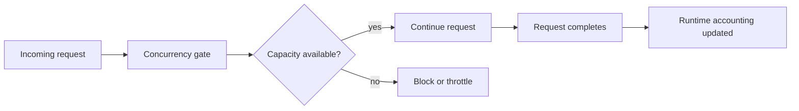

# Guardrail Modules

Odock guardrails are modular. Each module family focuses on a different class of runtime risk, and the gateway evaluates those modules at the point in the lifecycle where the right context exists.

The design goal is practical defense in depth. A single large "security check" would be hard to reason about, hard to tune, and easy to bypass by accident. Smaller modules make each decision explainable: one module answers traffic-shape questions, another answers access questions, another answers cost questions, and another answers prompt or response safety questions.

## Policy Context

Policy context is the effective set of user-facing policies that apply to the request. It can include organisation, team, API key, model, and MCP settings depending on what the request is doing.

This context lets Odock answer questions such as:

- Is this request coming from an expected network?
- Is this application allowed to use this model or tool server?
- Is the payload within the configured envelope?
- Does this workload have enough token, quota, or budget capacity?
- Are there resource-specific rules for this model or MCP server?

## IP Policy

IP policy limits where traffic may originate. It can be evaluated early because the origin is part of the request envelope and does not require model output or tool execution.

Use IP rules for network boundaries, such as allowing only office, cloud, or workload networks. They are not a substitute for API key authentication, access grants, or model/MCP governance.

## Ratelimit Modules

Ratelimit modules protect the gateway, upstream providers, and shared organisational capacity from sudden spikes or sustained overuse.

| Limit | Meaning |
| --- | --- |
| Requests per second | Controls short spikes. |
| Requests per minute | Controls sustained request volume. |
| Burst | Allows a short surge without making the normal rate unlimited. |
| Concurrency | Limits simultaneous in-flight work. |

Use request limits for workloads where traffic shape matters even before token usage or cost is known.

## Payload Limits

Payload limits protect the gateway and upstream services from unexpectedly large input or output envelopes.

| Limit | Meaning |
| --- | --- |
| Max request bytes | Stops oversized request bodies. |
| Max tokens per request | Stops unusually large requested output. |

Payload limits are intentionally separated from content safety. A request can be syntactically safe but too large. A request can also be small but unsafe. These are different problems and should be controlled by different modules.

## Concurrency

Concurrency guardrails answer: "How much work can this scope have in flight at once?"

This is different from requests per minute. RPM controls how many requests arrive over a time window. Concurrency controls how many are active at the same time.

## Token Limits

Token limits answer: "How much model capacity can this scope consume?"

Use them for LLM traffic where request count alone is not enough. Ten tiny requests and ten large completions should not have the same policy impact. Token-aware modules let Odock reason about the expected model workload and reconcile that expectation with the usage evidence produced by the provider.

## Access Grants

Access grants are hard runtime boundaries:

- model access decides which virtual API keys can call a model
- MCP access decides which virtual API keys can call an MCP server

An organisation user can create a model or MCP server without automatically making it callable. The API key still needs the explicit grant.

See [Model access grants](/docs/models-and-mcp/models/grant-model-to-api-key) and [MCP access grants](/docs/models-and-mcp/mcp-servers/grant-mcp-to-api-key).

## MCP Tool Guardrails

MCP servers expose tools, so Odock adds tool-level governance:

| Control | Behavior |
| --- | --- |
| Allowed tools | When set, only listed tools may run. |
| Blocked tools | Listed tools are denied. |
| Semantic filter | Applies configured content rules to MCP payloads. |
| Transport/auth config | Controls how Odock connects to the upstream MCP server. |

Use MCP rules when a server exposes mixed-risk tools, such as read-only search plus write-capable file or repository operations.

For more MCP detail, see [MCP Security](/docs/models-and-mcp/mcp-servers/security).

## Budgets And Quotas

Budgets and quotas are not ratelimit modules, but they are guardrails because they can prevent traffic that would exceed a cost or usage boundary.

- Budgets protect spend.
- Quotas protect usage counts, token counts, or other period-based metrics.
- Lifecycle-aware accounting helps concurrent requests respect the same remaining boundary.

See [Budgets](/docs/management/budgets) and [Quotas](/docs/management/quotas).

## Security Engine And Plugins

The Security Engine handles prompt and response safety. Ratelimit modules handle request-aware, network-aware, and token-aware traffic guardrails inside the staged ratelimit engine.

Read [Security Engine](/docs/security-and-guardrails/safetysec-engine) and [Ratelimit modules](/docs/security-and-guardrails/guardrails/plugin-gates) next.
