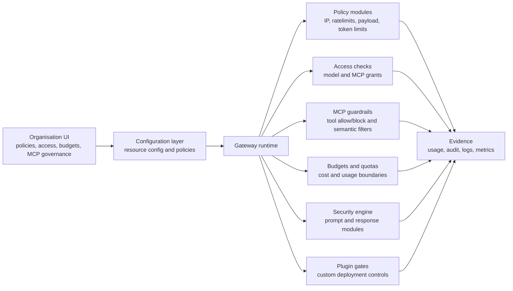

# Guardrails

Guardrails are the controls that decide whether runtime traffic can continue, must be limited, should be rewritten, should be observed, or must be blocked.

In Odock, guardrails are not only content filters. They include policy limits, access grants, IP rules, MCP tool controls, budgets, quotas, SafetySec modules, and plugins. They are applied at multiple lifecycle gates so cheap checks happen early and context-heavy checks happen only when the gateway has enough information.

## Core Ideas

| Concept | Meaning |
| --- | --- |
| Policy | JSON-backed configuration attached to an organisation, team, API key, model, or MCP server. |
| Scope | The level that contributes a policy: global, organisation, team, API key, model class, or MCP server. |
| Inheritance | A request can receive controls from multiple scopes. Each configured scope contributes its own limits. |
| Gate | A lifecycle point where Odock can allow, block, reserve, redact, mutate, or record. |
| Runtime accounting | Temporary accounting used to keep traffic, token, and cost decisions consistent while a request is in flight. |
| Shadow decision | A policy mode where Odock can observe what a guardrail would have done without interrupting traffic. |

For API key scope and lifecycle, see [Virtual API Keys](/docs/management/virtual-api-keys). For model and MCP resource concepts, see [Models & MCP](/docs/models-and-mcp).

## What Users Configure

The user-facing policy cards expose the guardrails most teams need:

- IP allowlist and blocklist
- tokens per minute
- max tokens per request
- max request bytes
- request burst
- requests per minute
- requests per second
- max concurrent requests
- concurrency lease TTL

MCP servers add tool-specific controls:

- allowed tools
- blocked tools
- semantic filter JSON
- transport and upstream authentication
- team or API-key scope for the server itself

Budgets and quotas add cost and usage boundaries. They are separate from rate limits: a rate limit protects live traffic shape, while a budget or quota protects spending and period-based usage. See [Budgets](/docs/management/budgets) and [Quotas](/docs/management/quotas).

## Guardrail Architecture

Runtime-sensitive edits are cached for speed and invalidated when resources change. A new request should pick up updated API key state, access grants, model config, MCP server config, pricing, and policies without changing application code.

## How Guardrails Fail Closed

Guardrails are designed to fail closed from the caller's perspective. A request that does not satisfy the active security, access, policy, or cost envelope should stop at the gateway rather than relying on the upstream model or MCP server to reject it.

Common outcomes include:

- invalid or revoked API key returns `401`
- missing model or MCP access returns `403`
- IP, payload, request, concurrency, or token limits return a rate-limit error
- budget exhaustion returns a budget error
- quota exhaustion returns a quota error
- SafetySec block returns a structured gateway safety error
- MCP tool or semantic rules return an MCP guardrail block
- plugin aborts return the plugin-provided gateway error

When a gate needs runtime accounting, Odock reconciles the decision after the request completes so usage records and limits stay aligned with what actually happened.

## Next

- [Policy inheritance](/docs/security-and-guardrails/guardrails/policy-inheritance)
- [Runtime enforcement](/docs/security-and-guardrails/guardrails/runtime-enforcement)
- [Guardrail modules](/docs/security-and-guardrails/guardrails/guardrail-modules)
- [Ratelimit modules](/docs/security-and-guardrails/guardrails/plugin-gates)
- [Custom guardrails](/docs/security-and-guardrails/guardrails/custom-guardrails)
