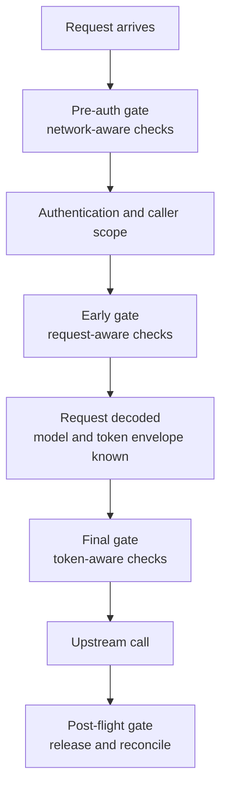

# Ratelimit Modules

Ratelimit modules are the low-level guardrail primitives used by the gateway to answer traffic-shape questions. They are not UI widgets and they are not generic plugins. They live in the ratelimit engine and are injected into lifecycle gates where the request has the right amount of context.

| Module family | What it answers | Typical gate |
| --- | --- | --- |
| IP/network | Is this request coming from an allowed or blocked network? | Pre-auth or early gate |
| RPS/RPM/burst | Is this scope receiving too many requests? | Early gate |
| Concurrency | Does this scope already have too much in-flight work? | Early gate |
| TPM | Would this request exceed the token-per-minute envelope? | Final gate |
| Overlays | Should a scoped policy be temporarily scaled? | Early and final gates |

The important design point is that modules are intentionally small. A module should do one kind of accounting or decision well. The stage decides when to call it, how to interpret its result, how to handle shadow mode, and whether the request should continue.

## Why Modules Are Injected Into Gates

Different guardrails need different request knowledge.

A network module can run before the gateway knows the model because it only needs origin information. A request-rate module needs the caller scope so it can apply organisation, team, API key, model, or MCP limits. A token module should not run until the gateway can estimate the token envelope. A reconciliation module only makes sense after the request has completed.

This separation keeps the system both efficient and explainable:

- cheap guardrails run before expensive work
- request-aware modules run before upstream calls
- token-aware modules run after token context exists
- post-flight modules clean up runtime accounting
- each denial can be tied back to a scope, limit name, retry window, and reason

## Gate Modes

When you add a ratelimit module, decide which gate mode it belongs to.

| Mode | Use for | Examples |
| --- | --- | --- |
| Pre-auth | Network or platform-wide checks that do not need a valid API key. | global IP allow/block |
| Early | Request-aware checks after authentication, before heavy upstream work. | payload bytes, RPS, RPM, burst, concurrency |
| Final | Token-aware checks after decoding and resource resolution. | max tokens, tokens per minute |
| Post-flight | Cleanup or reconciliation after the request finishes. | release concurrency, reconcile token usage |

Do not put a module in an earlier gate just to block faster. If the module needs model, MCP, or token context, it belongs later. A fast wrong decision is worse than a slightly later correct decision.

## Request-Aware Modules

Request-aware modules use fields from the normalized `RequestContext`: request id, path, method, content length, organisation id, team id, API key id, provider, model, and stream flag.

These modules are useful for limits that can be evaluated before the upstream call:

- payload too large
- requests per second
- requests per minute
- burst
- concurrent requests
- model or MCP scoped request pressure

They are normally injected into the early gate because authentication and caller scope are already known, but token usage may not be fully known yet.

## Network-Aware Modules

Network-aware modules focus on the client origin. They should be deterministic and cheap because they are often the first gate that can reject bad traffic.

Use them for:

- IP allowlists
- IP blocklists
- CIDR-style network boundaries
- organisation or key network policy checks after caller scope is known

Network checks can exist in more than one gate. A broad platform or deployment-level network rule can run before auth. A scoped rule that depends on the organisation, team, API key, model, or MCP server runs after those scopes are known.

## Token-Aware Modules

Token-aware modules protect LLM capacity and cost-sensitive workloads. They should run only after the gateway can reason about the requested model and token envelope.

Use them for:

- tokens per minute
- max tokens per request
- token-aware model policies
- token accounting that must be reconciled after the upstream response

Token-aware modules are why Odock treats guardrails as more than simple request counting. Two requests can have the same HTTP shape and very different token impact.

## Module And Stage Responsibilities

Keep this boundary clear:

| Layer | Responsibility |
| --- | --- |
| Module | Maintain one accounting primitive or decision primitive. |
| Stage/gate | Choose when to call modules, apply scoped policy, produce decisions, respect shadow mode, and manage receipts. |
| Policy resolver | Provide the effective scoped policy snapshot. |
| Post-flight | Release or reconcile runtime accounting after the request. |

This is the reason guardrails or ratelimit modules do not look like generic plugins. They are purpose-built primitives that the staged ratelimit engine composes.

Continue with [Custom guardrails](/docs/security-and-guardrails/guardrails/custom-guardrails) for the implementation workflow.
