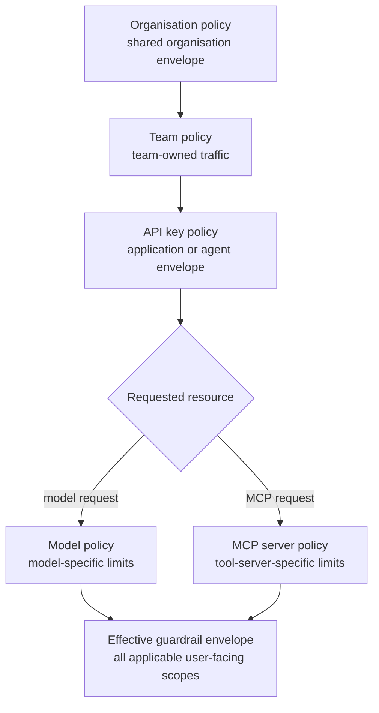

# Policy Inheritance

Policy inheritance answers one question: which configured limits apply to this request?

Odock evaluates policies across the scopes that matter for a request. Broad scopes express shared defaults. Narrow scopes express workload-specific constraints. Resource scopes express model-specific or MCP-specific constraints.

## Scope Hierarchy

The important detail is that a narrower scope does not simply erase broader scopes. Each configured scope contributes controls. A request must pass every applicable scope.

Example:

| Scope | Configured limit | Effect |
| --- | --- | --- |
| Organisation | 600 requests per minute | All organisation traffic using this route must fit inside this envelope. |
| API key | 60 requests per minute | This specific application is tighter than the organisation default. |
| Model | 20,000 tokens per minute | Calls to this model also need enough token capacity. |

The request passes only if the relevant organisation, API key, and resource guardrails allow it.

## Why Inheritance Works This Way

This model prevents accidental weakening. If an organisation sets a network allowlist or a global traffic envelope, a key-specific policy should not silently bypass it. Narrower scopes are used to add precision, not to make the broader boundary disappear.

Use the broadest scope for defaults and the narrowest scope for exceptions:

- Organisation policy: baseline network and traffic limits.
- Team policy: limits for a team-owned workload.
- API key policy: limits for a specific app, workflow, integration, or agent.
- Model policy: limits for an expensive or sensitive model.
- MCP policy: limits for a tool server or transport.

## IP Policy Behavior

IP policies are evaluated near the front of the lifecycle because network-origin decisions are most useful before more expensive work happens.

The gateway evaluates allowlists and blocklists from the applicable scopes. Use allowlists when traffic should come only from known networks. Use blocklists to deny known-bad networks while leaving the rest open.

For production traffic behind proxies, make sure your Odock deployment is configured so the gateway sees the intended client origin. Otherwise the IP rules users configure may not match what the gateway observes.

## Model And MCP Resource Scope

The resource scope is added after Odock knows what the request is calling:

- For model traffic, the requested model name is resolved to the organisation model record. The model policy can then contribute payload and token limits.
- For MCP traffic, the MCP slug or id is resolved to the MCP server record. The MCP policy can then contribute payload, request, and concurrency limits.

For model setup, see [Models](/docs/models-and-mcp/models). For MCP setup, see [MCP Servers](/docs/models-and-mcp/mcp-servers).

## Practical Pattern

Use this pattern for most organisations:

1. Set an organisation policy that represents the maximum acceptable baseline.
2. Set API key policies for application-specific behavior.
3. Set model policies only when a model needs a stronger envelope because it is expensive, sensitive, or slower.
4. Set MCP policies and tool governance for servers that expose high-risk tools.
5. Add budgets and quotas when cost or period usage matters more than instantaneous traffic shape.

Continue with [Runtime enforcement](/docs/security-and-guardrails/guardrails/runtime-enforcement) to see where these inherited policies run.
