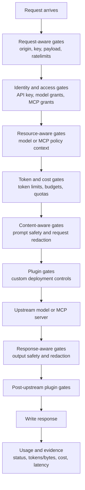
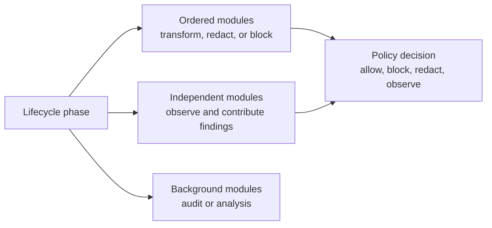

# Runtime Enforcement

The gateway enforces guardrails in stages. Each stage uses the information available at that moment, without exposing every internal step of the runtime.

This is the central design idea: no single guardrail can answer every security question. Network and request-shape questions are useful early. Access and policy questions need identity and resource context. Token and cost questions need model context. Safety questions need prompt or response content. Odock keeps those concerns modular and runs them at the gates where their decision is meaningful.

## Lifecycle

## Sequential, Parallel, And Async Work

Some checks are naturally ordered because they transform the request or depend on an earlier decision. Others can be evaluated independently because they only observe the request or response. Some work can happen after the response path because it is evidence, audit, or analytics rather than a user-visible block.

Examples:

| Mode | Used for | Why |
| --- | --- | --- |
| Ordered | redaction, request transforms, blocking gates | The result changes what later gates see. |
| Independent | pattern checks, risk checks, audit observers | Multiple modules can contribute evidence to the decision. |
| Background | post-response audit or analysis | Non-blocking work should not slow down the caller. |

## Request-Aware Gates

Request-aware guardrails are designed to protect the gateway before expensive work begins.

| Gate | What it can enforce |
| --- | --- |
| Network and admission gates | IP allow/block rules and coarse request admission. |
| Ratelimit gates | request bytes, requests per second, requests per minute, burst, concurrency |
| MCP guardrail | tool allow/block lists and semantic keyword filters |
| Access grant | whether this API key can call the selected model or MCP server |

These checks are best for abuse prevention, network control, and traffic shaping.

## Token-Aware Gates

Token-aware guardrails need the request body, model, and token envelope.

| Gate | What it can enforce |
| --- | --- |
| Token gates | max tokens and token-rate boundaries |
| Budget/quota gates | request count, token count, and cost boundaries |
| Usage reconciliation | final usage attribution and policy evidence |
| Usage collection | final attribution, provider usage, cost, latency, and status |

These checks are best for model-specific control and cost protection.

## Why Final Reconciliation Matters

Token and cost limits need to make a decision before the upstream provider answers, then compare that decision with actual usage afterward.

This design prevents a common failure mode: many concurrent requests can look individually safe at admission time but collectively exceed the intended token or cost envelope by the time they complete. Odock treats token and cost guardrails as lifecycle-aware, not just as a final reporting step.

Continue with [Guardrail modules](/docs/security-and-guardrails/guardrails/guardrail-modules).
