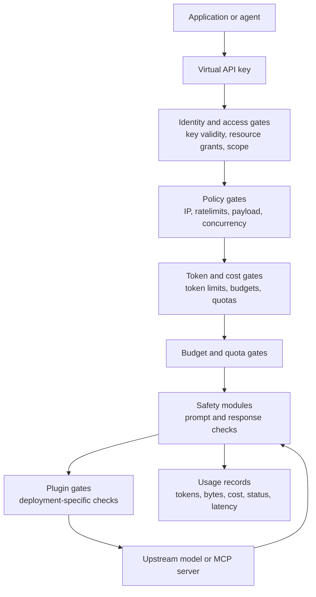

# Security & Guardrails

Security in Odock is layered. A request is allowed only when the caller, the resource, the policy envelope, the safety checks, the cost controls, and the plugin gates all agree that it can continue.

This section is written for organisation users who configure and operate Odock resources. It explains what happens at runtime without requiring you to manage server internals.

## What This Section Covers

- **Guardrails**: policy scopes, inheritance, request limits, token limits, IP rules, MCP tool rules, budgets, quotas, and plugin gates.
- **Security Engine**: SafetySec phases, built-in modules, session scoring, redaction, blocking, and response checks.
- **Tutorials**: UI-driven steps for configuring organisation, API key, model, and MCP guardrails, plus how to verify enforcement in usage records.

For virtual API keys, see [Virtual API Keys](/docs/management/virtual-api-keys). For model access and MCP access, see [Models & MCP](/docs/models-and-mcp). For budgets and quotas, see [Budgets](/docs/management/budgets) and [Quotas](/docs/management/quotas).

## Runtime Security Model

Odock treats guardrails as both **request-aware** and **token-aware**:

- Request-aware controls reason about the request envelope: where traffic comes from, which key is used, which resource is requested, how large the payload is, and whether the request fits the policy envelope.
- Token-aware controls reason about model usage: requested output size, token budgets, token-rate limits, pricing, quota windows, and final usage attribution.
- Content-aware controls reason about prompt and response content: sensitive data, unsafe instructions, leakage risk, and custom business checks.

The philosophy is to apply the right guardrail at the right moment. Some gates protect the platform before expensive work begins. Some gates need the API key, organisation, model, MCP server, or token context. Some modules need prompt or response text. Odock keeps these concerns separate so policies stay explainable, safety checks stay modular, and the gateway can make consistent decisions across models and tools.

## Where Guardrails Come From

Guardrails are configured at several layers:

| Layer | Typical purpose | Where users see it |
| --- | --- | --- |
| Organisation policies | Default network and traffic envelope for an organisation. | Organisation Settings, Policies card |
| API key policies | Tight limits for one application, agent, or workflow. | API key detail, Policies card |
| Model policies | Resource-specific caps for a model. | Model detail, Policies card |
| MCP policies and governance | Tool access, semantic filters, payload/rate limits, transport security. | MCP server detail cards |
| Access grants | Decide whether an API key can call a model or MCP server at all. | API key detail, Model Access and MCP Access |
| Budgets and quotas | Cost and usage ceilings for live traffic. | API key detail, Budgets and Quotas |
| Security engine | Prompt/response safety, redaction, leakage checks, and repeated-risk awareness. | Runtime behavior and usage/audit evidence |
| Plugins | Custom checks or transformations injected at lifecycle gates. | Runtime behavior configured by your Odock deployment |

## Recommended Reading Order

1. [Guardrails](/docs/security-and-guardrails/guardrails): understand policy scopes, runtime gates, modules, and plugins.
2. [Policy inheritance](/docs/security-and-guardrails/guardrails/policy-inheritance): learn how inherited limits combine.
3. [Runtime enforcement](/docs/security-and-guardrails/guardrails/runtime-enforcement): see when each gate runs.
4. [Security Engine](/docs/security-and-guardrails/safetysec-engine): understand SafetySec and its modules.
5. [Tutorials](/docs/security-and-guardrails/tutorials): configure guardrails from the organisation UI.
