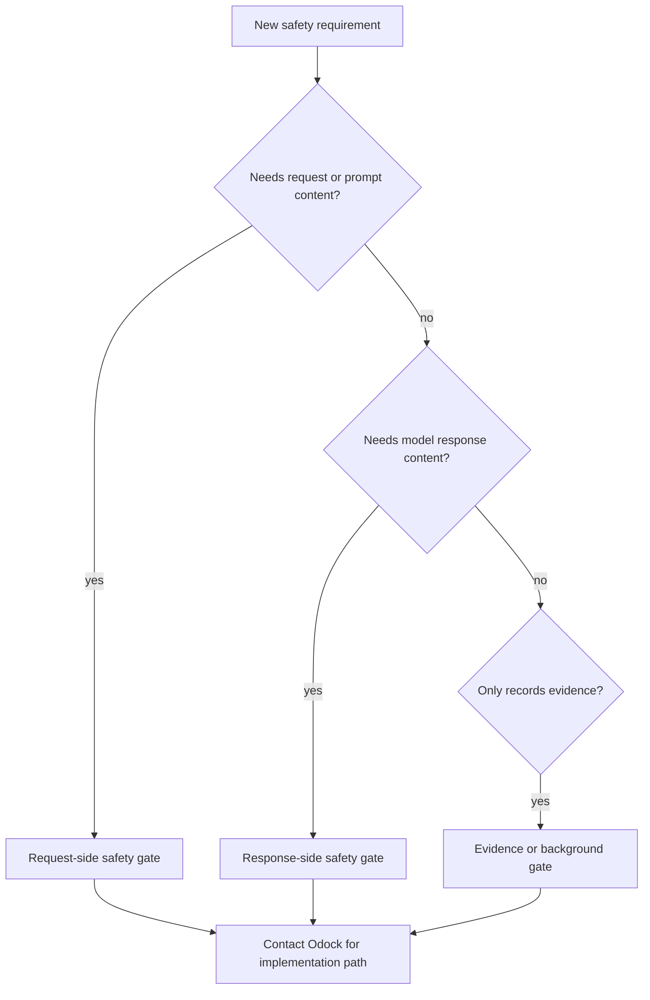

# Create A Security Module

Security Engine modules extend SafetySec when an organisation needs new prompt or response safety behavior.

This page explains the public planning process for a new SafetySec module. It intentionally avoids internal implementation contracts, registration details, detector internals, scoring formulas, and deployment-specific wiring. If you need to build a module for production, contact the Odock team so we can provide the full implementation path for your deployment.

Use this path when the new safety capability is:

- **prompt-aware**: it evaluates user, system, developer, or tool-context input before upstream work
- **response-aware**: it evaluates model output before the caller receives it
- **redaction-aware**: it removes or masks sensitive content while allowing the request or response to continue
- **risk-aware**: it observes repeated or high-risk behavior and may escalate from observe to block
- **evidence-aware**: it produces auditable safety evidence for operators

If the requirement is about traffic shape, request volume, payload size, concurrency, network boundaries, or token envelopes, use [Custom guardrails](/docs/security-and-guardrails/guardrails/custom-guardrails) instead.

## Design Philosophy

A Security Engine module should answer one safety question clearly.

Good questions:

- Does this prompt try to override intended instructions?
- Does this prompt look like a policy-bypass attempt?
- Does this request contain sensitive information that should be redacted?
- Does this response expose sensitive or unsafe output?
- Should repeated suspicious behavior be handled more strictly?
- What evidence should operators see when this module acts?

Poor questions:

- Can this module own all gateway security?
- Can this module replace access grants, ratelimits, budgets, or quotas?
- Can this module implement custom business approval workflow?
- Can this module hide a policy that users need to understand?

The philosophy is separation of concerns. SafetySec modules protect prompt and response content. Ratelimit modules protect traffic shape and runtime capacity. Access grants protect resource authorization. Budgets and quotas protect cost and period usage. Plugins handle custom business workflow.

## Step 1: Classify The Safety Need

Write the module requirement in one sentence:

```txt
Observe, redact, or block <content or behavior> when it appears in <request or response moment>.
```

Examples:

| Requirement | Classification |
| --- | --- |
| Detect attempts to override the intended instruction hierarchy. | Prompt-aware |
| Redact sensitive values before they leave Odock. | Prompt-aware, redaction-aware |
| Redact sensitive values before the caller receives output. | Response-aware, redaction-aware |
| Block model output that appears to expose protected data. | Response-aware |
| Record safety evidence for repeated suspicious behavior. | Risk-aware, evidence-aware |

If the requirement mentions requests per minute, payload bytes, concurrent calls, IP ranges, token windows, or cost boundaries, it is not a SafetySec module.

## Step 2: Choose The Lifecycle Moment

Choose the moment by asking what content the module needs.

| Needed context | Best lifecycle moment | Reason |
| --- | --- | --- |
| Request content before upstream work | Request-side safety gate | The module protects what leaves Odock. |
| Response content before the caller sees it | Response-side safety gate | The module protects what returns to the caller. |
| Final evidence after the response path | Evidence or background gate | The module records or analyzes without changing the response. |

Do not place a module earlier than its required context. A response-safety module cannot make a correct decision before the model output exists. A request-redaction module should run before the content is sent upstream.



## Step 3: Define The Action Model

A module should use the least disruptive action that solves the risk.

| Action | Use when |
| --- | --- |
| Observe | The finding is useful evidence but should not interrupt traffic. |
| Redact | Sensitive content can be safely removed or masked. |
| Block | The request or response should not continue. |
| Escalate | Repeated or high-confidence findings should become stricter over time. |

For each action, define:

- what the user or caller sees
- whether the request continues
- whether the content is changed
- whether the action should appear in usage, logs, or audit evidence
- whether the behavior should start in observe mode before blocking

## Step 4: Define Evidence And Explainability

Safety modules must be explainable to operators.

Plan:

- a plain-language reason for the action
- whether the finding is request-side, response-side, or evidence-only
- whether the module observed, redacted, or blocked
- what scope or request id operators should use to investigate
- how to distinguish expected safety enforcement from module failure
- what dashboards, usage records, logs, or audit exports should show

Avoid exposing exact detector rules, scoring formulas, private prompt patterns, or internal thresholds in public-facing documentation. Users need to understand the outcome and operating model, not the bypass surface.

## Step 5: Plan User Controls

Some SafetySec modules are deployment-wide. Others may need user-facing controls.

Before implementation, decide:

- whether the behavior is always on or configurable
- whether it applies to all models or only selected models
- whether it applies to specific API keys, teams, or MCP-enabled workflows
- whether users can choose observe, redact, or block behavior
- whether the module interacts with budgets, quotas, model access, MCP access, or ratelimits

If a user is expected to operate the module, document the control in the relevant UI tutorial or concept page.

## Step 6: Plan Tests And Rollout

Before production rollout, validate:

- normal prompts and responses continue
- matching unsafe content is observed, redacted, or blocked as designed
- redaction does not corrupt valid response structure
- blocked responses produce a stable user-visible reason
- repeated-risk behavior works as expected, if supported
- logs and usage evidence are enough for operators
- operational failures are distinguishable from normal safety denials

Roll out narrow first:

1. Start with a limited model, team, API key, or organisation.
2. Prefer observe mode when impact is uncertain.
3. Review findings with real traffic samples.
4. Move to redact or block only when false positives are acceptable.
5. Expand the scope after operators understand the behavior.

## When To Contact Odock

Contact the Odock team when:

- the module needs custom detection logic
- the module needs redaction behavior beyond existing controls
- the module needs response-side safety enforcement
- the module needs repeated-risk handling
- the module must interact with model, MCP, API key, budget, quota, or ratelimit settings
- you are unsure whether the requirement belongs in SafetySec, ratelimits, budgets, quotas, access grants, or plugins

For special needs, send us:

- the one-sentence safety requirement
- whether it is request-side, response-side, or evidence-only
- examples of content that should be allowed, observed, redacted, or blocked
- expected user-visible behavior
- whether rollout should start in observe mode
- any model, MCP, API key, team, or organisation scope requirements

We will provide the full implementation path for your deployment, including the internal module shape, lifecycle placement, test strategy, observability plan, and rollout guidance.

## Rule Of Thumb

Use a SafetySec module when the requirement is about prompt safety, response safety, redaction, leakage, or repeated risky behavior.

Use a ratelimit module when the requirement is about traffic shape, network boundaries, request pressure, payload size, concurrency, or tokens.

Use a plugin when the requirement is custom business workflow outside safety and ratelimit semantics.
