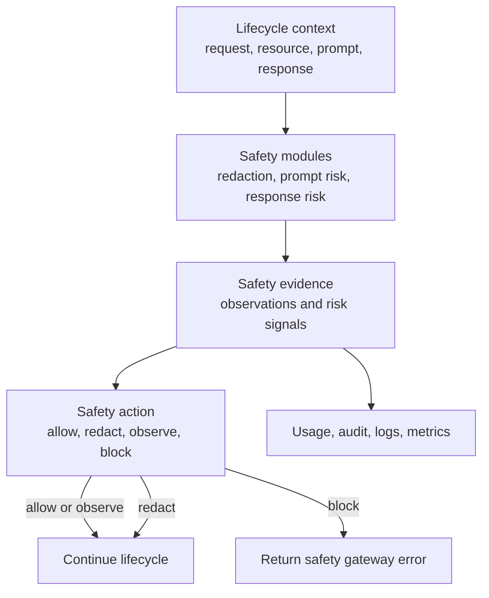

# Security Engine

The Odock security engine is called SafetySec in the runtime. It is a modular engine for prompt safety, response safety, redaction, leakage detection, and repeated-risk awareness.

SafetySec is separate from policy limits. Policies control traffic shape and resource boundaries. SafetySec inspects prompt and response content when text is available.

## What SafetySec Does

| Capability | Purpose |
| --- | --- |
| Prompt-injection detection | Detect attempts to override instructions, reveal hidden context, or bypass policy. |
| Jailbreak-pattern detection | Detect jailbreak phrasing and roleplay-style bypass attempts. |
| Sensitive redaction | Redact secrets and PII-like values in requests and responses. |
| Data-leakage detection | Detect sensitive material in model output or echoed from the request. |
| Repeated-risk awareness | Treat repeated suspicious behavior differently from isolated low-risk events. |
| Safety evidence | Produce evidence that helps users understand whether a request was allowed, redacted, observed, or blocked. |

## Engine Architecture

## SafetySec is lifecycle-aware:

| Moment | Typical use |
| --- | --- |
| Before upstream work | Prompt checks, sensitive input handling, request-side redaction. |
| After upstream work | Response checks, output redaction, leakage protection. |
| After response handling | Non-blocking audit, metrics, or analysis where configured. |

The exact internal plan is deployment-managed. The public model is that SafetySec modules run at the points where their required context exists.

## How It Differs From Guardrail Policies

| Policy guardrails | Security engine |
| --- | --- |
| Configured through resource policies, access grants, budgets, and quotas. | Configured through security modules in the Odock deployment. |
| Enforce network, traffic, payload, token, cost, and resource access boundaries. | Inspects prompt and response text for safety and sensitive data. |
| Often blocks before upstream calls. | Can redact before the upstream call or block/redact after response. |
| Works from request metadata and token envelope. | Works from request/response content and session history. |

For policy guardrails, see [Guardrails](/docs/security-and-guardrails/guardrails).

## User Impact

When SafetySec blocks, the caller receives a structured gateway error instead of an upstream response. When it redacts, the request or response continues with sensitive values replaced by redaction markers.

Because SafetySec can work before and after the provider call, it can protect both sides:

- before upstream: prevent sensitive input and suspicious prompts from leaving through the provider request
- after upstream: prevent sensitive output or leakage from reaching the caller

Continue with [Security workflow](/docs/security-and-guardrails/safetysec-engine/workflow).
