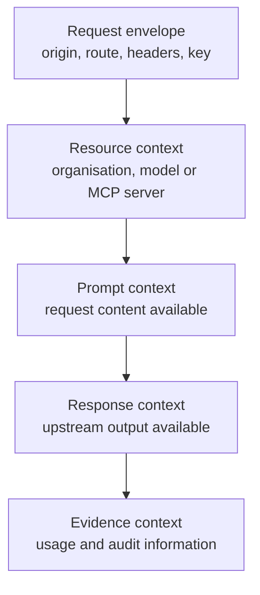
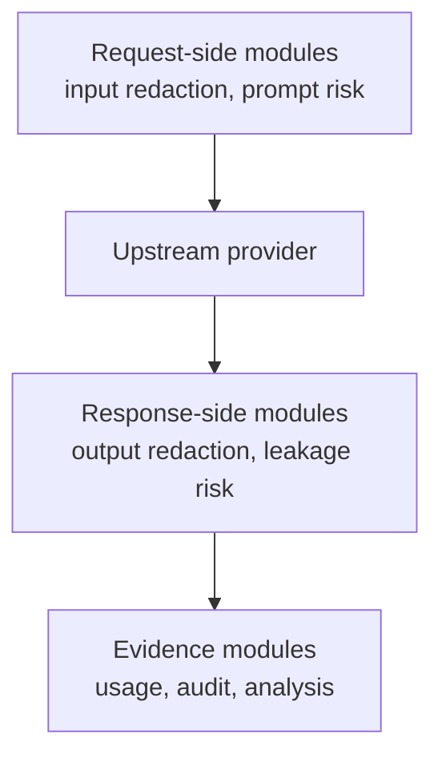
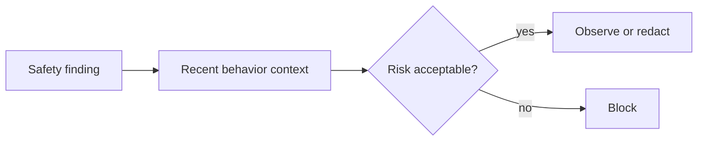

# Security Workflow

SafetySec evaluates modules across the request lifecycle. The available context changes over time: early gates know less, prompt-side gates know the request content, and response-side gates know what the upstream produced.

## Context Growth

This context growth is why SafetySec is not a single yes/no check at the start of the request. A module that protects prompt input cannot evaluate model output. A module that protects response leakage cannot run before the response exists. The engine is designed around those timing constraints.

## Module Timing

Request-side modules protect what leaves Odock. Response-side modules protect what returns to the caller. Evidence modules help teams understand what happened after the decision.

## Combining Module Findings

Modules can contribute different kinds of findings:

- allow: the module found no reason to intervene
- observe: the module found something worth recording
- redact: the module found sensitive content that can be safely removed
- block: the module found content or behavior that should not continue

Odock combines those findings into a single safety decision for the current gate. This lets multiple modules participate without forcing every module to understand every type of risk.

## Repeated-Risk Awareness

Repeated-risk awareness lets Odock treat patterns differently from isolated events. A single low-confidence finding may only be observed, while repeated suspicious behavior can justify stronger enforcement.

## Ordered, Independent, And Background Modules

Safety modules are designed so different kinds of work can happen in the right style:

- Ordered modules are used when one module changes what later modules should see, such as redaction.
- Independent modules are used when multiple checks can contribute findings without depending on one another.
- Background modules are used for non-blocking audit or analysis.

Blocking decisions should happen before the response is written. Background work is for evidence and analysis, not for retroactively changing what the caller already received.

Continue with [Security modules](/docs/security-and-guardrails/safetysec-engine/modules).
