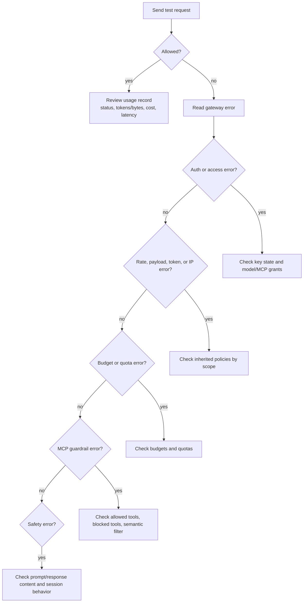

# Verify Enforcement

After you configure guardrails, verify that they work from the caller's point of view and from Odock's records.

<Steps>

<Step>
Send a normal request that should be allowed.

Use an API key with the correct model or MCP access grant.

</Step>

<Step>
Open the API key detail page and review **Usage Records**.

Confirm the request id, status, provider, model or MCP server, latency, token or byte usage, and cost are recorded.

</Step>

<Step>
Trigger one controlled block.

Examples:

| Control | Safe test |
| --- | --- |
| Requests per minute | Set a very low API key RPM and send repeated requests. |
| Max tokens | Set max tokens below the test request value. |
| Max request bytes | Send a request body larger than the configured limit. |
| MCP blocked tool | Call a tool listed in **Blocked Tools**. |
| Budget or quota | Use a test key with a very small budget or quota. |
</Step>

<Step>
Read the caller-visible error.

The error tells you which class of guardrail blocked:

| Error class | Likely source |
| --- | --- |
| `401 unauthorized` | API key authentication failed, key expired, or key revoked. |
| `403 model_not_allowed` | Missing model access grant. |
| `403 mcp_not_allowed` | Missing MCP access grant. |
| rate-limit error | IP, payload, request rate, burst, concurrency, or token policy. |
| `budget_exceeded` | Budget boundary blocked the request. |
| `quota_exceeded` | Quota boundary blocked the request. |
| `mcp_guardrail_block` | MCP tool rule or semantic filter blocked. |
| safety gateway error | Security Engine module blocked. |
</Step>

<Step>
Compare the result with the configured scope.

Check the broadest likely scope first:

1. Organisation policy
2. Team policy, if the key is team-scoped
3. API key policy
4. Model or MCP policy
5. Budget or quota on the organisation, team, user, or API key
6. MCP tool rules or SafetySec behavior
</Step>

<Step>
Review resource-specific usage.

For model traffic, open the model detail page and review **Usage Records**.

For MCP traffic, open the MCP server detail page and review **MCP Usage**.

</Step>

</Steps>

## Verification Flow

## Why This Works

Guardrails are enforced before usage is recorded only when the request stops early. Successful upstream calls and many failed upstream calls produce usage records. Early authentication or policy blocks may be visible through gateway logs and caller errors rather than normal usage rows.

Use request ids when correlating an application error with Odock runtime evidence.
