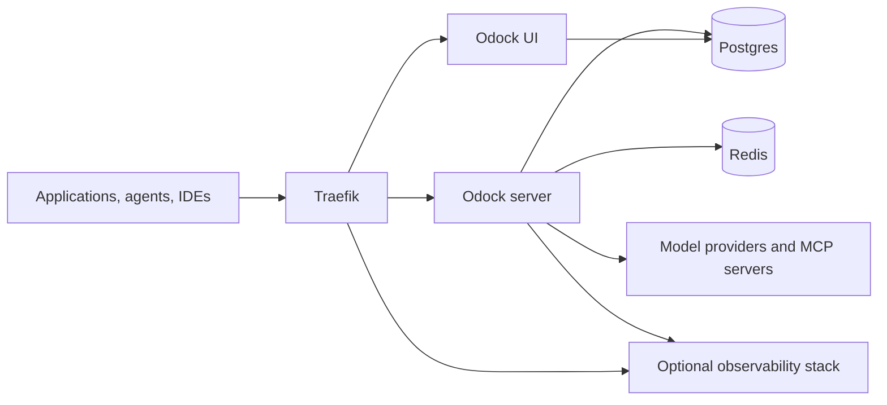

# Self Host

Odock self-hosting lets you run the gateway and operator UI on your own infrastructure.

This offer is currently available on request and limited to testing users and selected clients for now. Reach out to us if you want more information, want to evaluate the stack, or want to become an early testing user.

## What Is Included

The self-hosted platform is organized into a few clear layers so teams can understand what they would operate and what remains optional.

| Part | Purpose |
| --- | --- |
| Gateway server | Handles LLM and MCP traffic, policy enforcement, routing, usage recording, and health checks. |
| Operator UI | Lets platform teams configure providers, models, API keys, policies, and review usage. |
| Postgres | Stores application data, configuration, and persisted usage records. |
| Redis | Supports runtime coordination and short-lived operational state. |
| Traefik | Exposes the HTTP entry points and routes traffic to the UI, API, and optional Grafana endpoints. |
| UI migrations | Applies the required database migrations before the UI starts. |
| Observability stack | Optional Grafana, Prometheus, Loki, Tempo, Alertmanager, and exporters for platform monitoring. |

## How The Parts Fit Together

At a high level, applications call the Odock gateway through a controlled ingress layer. The gateway enforces policy and forwards requests to upstream providers or MCP servers. The data layer stores persistent state, the runtime layer supports gateway operations, and the UI gives operators a control plane for managing the deployment.

## What A Self-Hosted Deployment Usually Requires

For most teams, a self-hosted rollout means setting up a few standard infrastructure concerns:

- persistent storage for platform data and audit records
- runtime secrets and encryption material
- ingress, DNS, TLS, and internal or external network access
- operator access to the UI and platform monitoring surfaces
- optional observability for logs, metrics, traces, and alerts

Odock helps centralize AI governance, but the exact deployment shape depends on your environment, security model, and internal platform standards.

## Why Teams Ask For Self-Hosting

Teams usually ask for self-hosting when they want:

- infrastructure control inside their own network boundary
- tighter alignment with internal security and compliance requirements
- private connectivity to upstream models, MCP servers, or enterprise systems
- platform ownership over data retention, monitoring, and operational policies

## Section Guide

- [Quickstart](/docs/self-host/quickstart): high-level view of what a self-hosted rollout needs before evaluation or onboarding.
- [Config Files](/docs/self-host/config-files): the main categories of runtime configuration and secrets a deployment needs.
- [Docker Compose](/docs/self-host/docker-compose): the main service groups in the reference self-hosted stack.
- [Observability Stack](/docs/self-host/observability-stack): the optional monitoring layer for platform operators.

## Contact Us

If you want to explore self-hosting, contact us for more information. We currently open this offering to selected testing users and clients while we continue shaping the rollout model.
