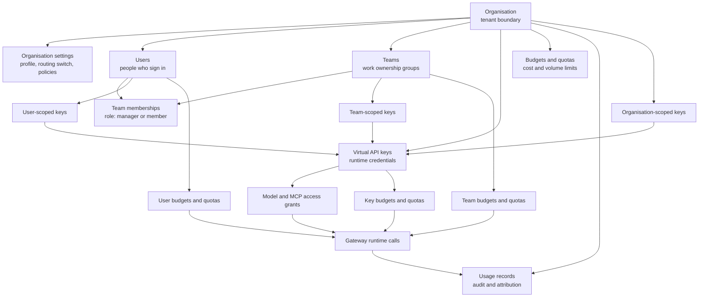
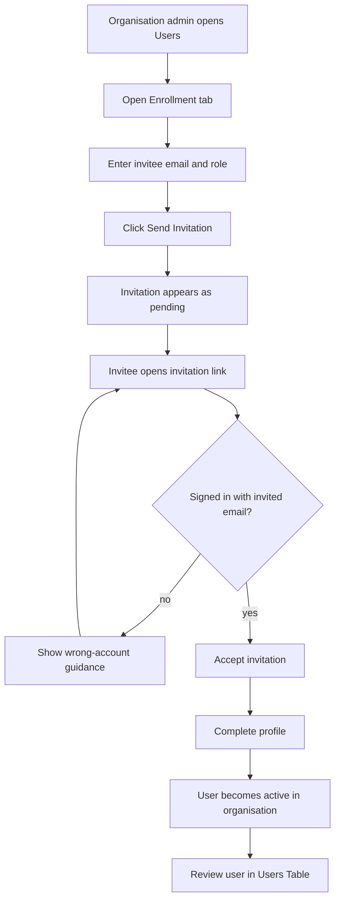
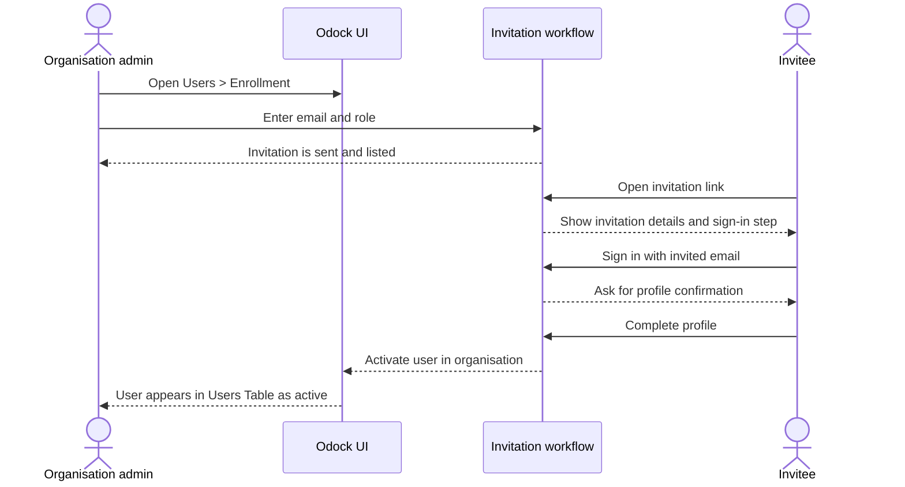

# User Management

User management is the place where an organisation decides who can work in Odock, what part of the organisation they belong to, and which operational resources they can own or supervise.

This section is written for organisation users who work inside the Odock UI. It explains the concepts behind the access model, then gives UI-driven tutorials for organisation settings, users, teams, enrollment, membership, and day-to-day access operations.

Odock separates two ideas that are often mixed together:

- **UI access**: who can sign in to Odock and manage configuration.
- **Runtime access**: which virtual API keys can call models or MCP servers through the gateway.

A user login does not call models directly. Applications call Odock through [Virtual API Keys](/docs/management/virtual-api-keys). User management decides who can configure those keys, who owns them, and how usage is attributed.

## Governance Philosophy

Odock user management is built around a simple governance principle: access should follow the real operating structure of the organisation.

An organisation usually has teams, teams have members, and work is performed through shared or personal credentials. Odock mirrors that structure in the UI so that permissions, budgets, quotas, usage records, and access reviews can be understood without reading infrastructure code.

The practical rules are:

- **Organisation first**: every normal user-management action happens inside one organisation workspace.
- **Teams group responsibility**: teams represent business units, product squads, departments, projects, or any other ownership boundary.
- **Users are accountable people**: users sign in, receive an organisation role, and can be added to one or more teams.
- **Membership gives context**: a user can belong to multiple teams, and a team membership can mark the user as a team manager or team member.
- **Runtime credentials stay explicit**: model and MCP access is granted to virtual API keys, not assumed from a UI login.
- **Controls layer together**: organisation, team, user, and API key scopes can all affect visibility, attribution, budgets, quotas, and guardrails.

For runtime safety and policy layering, see [Guardrails](/docs/security-and-guardrails/guardrails) and [SafetySec Engine](/docs/security-and-guardrails/safetysec-engine). For cost boundaries, see [Budgets](/docs/management/budgets) and [Quotas](/docs/management/quotas). For traffic analysis, see [Usage Monitoring](/docs/observability/usage-monitoring).

## Mental Model

The user-management hierarchy is not a strict tree of people. It is a tenant model with team memberships.

Use this hierarchy when deciding where to place access:

| Need | Best fit |
| --- | --- |
| A service used by the whole organisation | Organisation-scoped API key |
| A product squad, department, or shared agent | Team-scoped API key |
| An individual experiment or personal workflow | User-scoped API key |
| Shared cost limits for a department | Team budget or quota |
| Personal sandbox limits | User budget or quota |
| Operational review of people and memberships | Users and teams pages |

## Roles

Organisation-facing Odock work normally uses three roles:

| Role | Use it for | Typical access pattern |
| --- | --- | --- |
| Organisation Admin | People responsible for the whole organisation workspace | Manage users, teams, organisation settings, credentials, access, budgets, quotas, and usage views |
| Manager | People responsible for assigned teams | Work with team-level users, team-owned credentials, and team usage |
| User | People who need governed access to Odock capabilities | View allowed organisation resources, work with their own profile, and use permitted workflows |

Roles define what the UI shows and what actions are allowed. Team membership then narrows or expands the context for team-specific work.

## Enrollment Overview

The recommended way to add people is the enrollment workflow in the **Users** page. It gives the invitee a controlled path from invitation to active account and leaves an invitation trail for review.

## UI Map

In the organisation workspace, the main navigation exposes user-management work through:

- **Users**: user list, enrollment workflow, approval actions, user detail pages.
- **Teams**: team list, team creation, team detail pages, membership management.
- **Settings**: organisation profile, routing switch, and organisation policies.

The detail pages are important because they collect related governance information in one place:

- A user detail page shows profile fields, teams, user-owned API keys, usage records, budgets, and quotas.
- A team detail page shows team fields, policies, members, team-owned API keys, usage records, budgets, and quotas.
- Organisation settings show organisation identity, the routing enablement switch, and organisation-level policies.

## What To Read Next

Start with [Organisation](/docs/user-management/organisation) to understand the tenant boundary, then read [Users](/docs/user-management/users) for enrollment and account operations, and [Teams](/docs/user-management/teams) for group ownership and membership.

