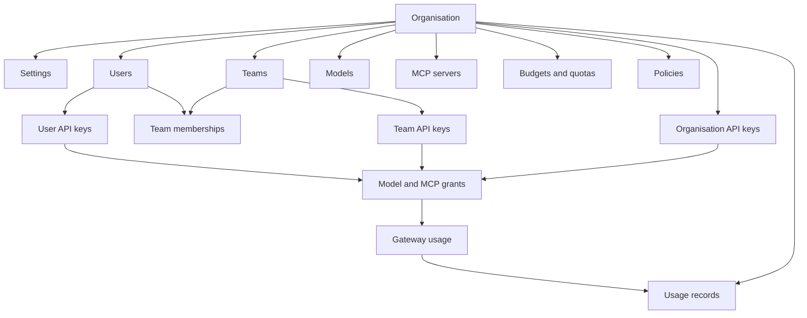

# Organisation

An organisation is the main workspace boundary in Odock. It contains the people, teams, models, MCP servers, virtual API keys, cost controls, policies, and usage records that belong together.

For organisation users, most work starts by choosing the organisation workspace, then using the sidebar to manage **Users**, **Teams**, **API Keys**, **Budgets**, **Quotas**, **Usage Records**, and **Settings**.

## Concept

The organisation is the tenant boundary. It answers questions such as:

- Which users belong to this workspace?
- Which teams exist in this workspace?
- Which virtual API keys can be created and owned here?
- Which models and MCP servers are available for governed use?
- Which budgets, quotas, and policies apply at the broadest organisation scope?
- Which usage records should appear in organisation-level reporting?

The organisation does not replace more specific scopes. It gives them a shared boundary. Teams, users, and API keys exist inside the organisation and can add more specific ownership or controls.

## Inheritance And Scope

In Odock, inheritance is best understood as layered governance:

- Organisation settings and policies provide the broad workspace context.
- Team scope adds group ownership and team-level attribution.
- User scope adds personal ownership and accountability.
- API key scope controls the actual runtime credential used by applications.

For example, a team-scoped API key belongs to the organisation and is attached to a team. Its traffic can be reviewed under the organisation, the team, and the key. It can also be affected by team budgets, quotas, key-level grants, and broader guardrails.

For deeper runtime policy behavior, see [Guardrails](/docs/security-and-guardrails/guardrails). For model and MCP runtime access, see [Models](/docs/models-and-mcp/models), [MCP Servers](/docs/models-and-mcp/mcp-servers), and [Virtual API Keys](/docs/management/virtual-api-keys).

## Settings Page

Open **Settings** from the organisation sidebar to manage the organisation profile and broad controls.

The settings page shows:

- **ID**: the organisation identifier.
- **Name**: the display name used across the UI.
- **Contact**: the operational contact for the organisation.
- **Status**: the current organisation status.
- **Created** and **Updated** timestamps.
- **Routing enablement**: the organisation-level switch that allows smart routing to be used.
- **Policies**: organisation-level policy settings.

## Tutorials

- [Update organisation information](/docs/user-management/organisation/update-information)
- [Manage the routing switch](/docs/user-management/organisation/manage-routing-switch)
- [Review organisation policies](/docs/user-management/organisation/review-policies)

## Operational Checklist

Before inviting many users, review:

- Organisation name and contact are clear.
- Teams exist for the main ownership groups.
- The intended organisation admins and managers are known.
- Budget and quota strategy is decided. See [Budgets](/docs/management/budgets) and [Quotas](/docs/management/quotas).
- Model and MCP access will be granted through virtual API keys. See [Virtual API Keys](/docs/management/virtual-api-keys).
- Usage review expectations are clear. See [Usage Monitoring](/docs/observability/usage-records).
