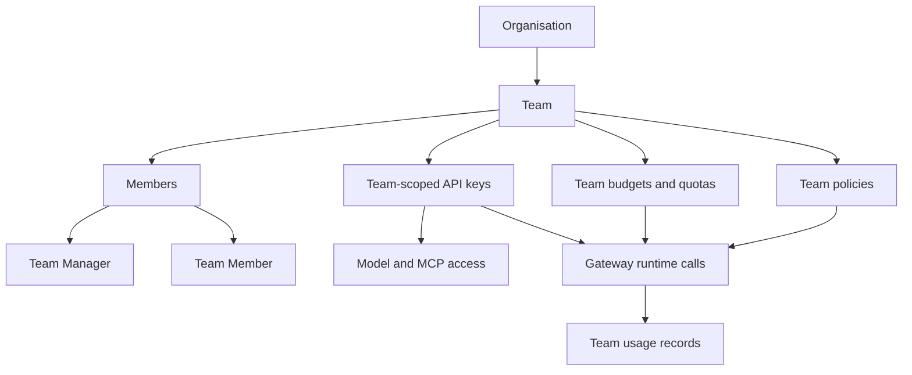

# Teams

Teams group users around shared responsibility. They are the main way to represent departments, product squads, projects, environments, or any other group that should own credentials, budgets, quotas, and usage review together.

Teams sit inside an organisation. A user can belong to multiple teams, and each membership has a team role.

## Concept

A team answers these questions:

- Which people work together?
- Who manages this group?
- Which API keys belong to the group?
- Which budgets and quotas limit group usage?
- Which usage records should be reviewed at team level?

Teams create an ownership scope for governance. When a team owns a key, the key's traffic can be reviewed as team traffic, and team budgets or quotas can limit that work.

For runtime keys, see [Virtual API Keys](/docs/management/virtual-api-keys). For spending and volume controls, see [Budgets](/docs/management/budgets) and [Quotas](/docs/management/quotas).

## Team Membership

| Membership role | Use it for |
| --- | --- |
| Team Manager | A person responsible for managing or supervising the team |
| Team Member | A person who belongs to the team but should not manage it |

A user's organisation role and team membership role are different. The organisation role describes broad UI access. The team membership role describes that person's relationship to one specific team.

## Teams Page

Open **Teams** from the organisation sidebar.

The teams list includes:

- Search.
- Team name.
- Updated and created timestamps.
- **Open** action.
- **Refresh**.
- **Add New Team** when your role allows it.

## Team Detail Page

Open a team from the teams list to manage its full governance context.

The team detail page shows:

- Team fields: ID, name, organisation, created date, updated date.
- **Policies**: team-level policy controls.
- **Members**: users in the team.
- **API Keys**: team-scoped virtual API keys.
- **Usage Records**: gateway activity for the team.
- **Budgets**: team-owned budgets.
- **Quotas**: team-owned quotas.

## Tutorials

- [Create a team](/docs/user-management/teams/create-team)
- [Rename a team](/docs/user-management/teams/rename-team)
- [Add a member](/docs/user-management/teams/add-member)
- [Remove a member](/docs/user-management/teams/remove-member)
- [Review team-owned API keys](/docs/user-management/teams/review-team-api-keys)
- [Review team policies](/docs/user-management/teams/review-team-policies)
- [Review team usage](/docs/user-management/teams/review-team-usage)

## Practical Guidance

- Create teams for real ownership groups.
- Add users to every team they actually work with.
- Use **Team Manager** only when the person should supervise that team.
- Prefer team-scoped keys for shared services or agents.
- Review team keys after membership changes.
- Put cost controls at team level when the group owns the spend.
- Use usage records to validate whether team access still matches real work.
