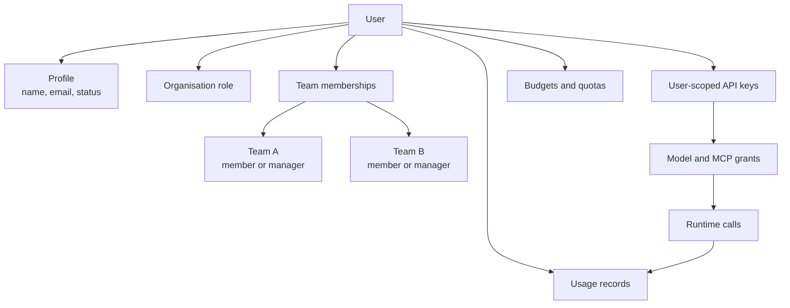
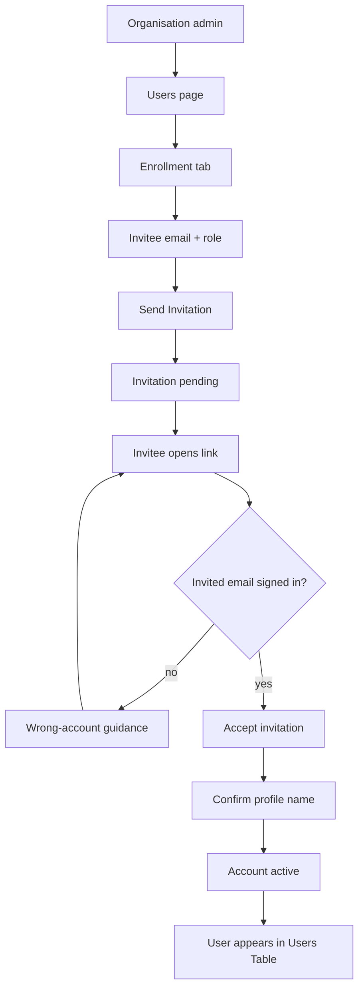
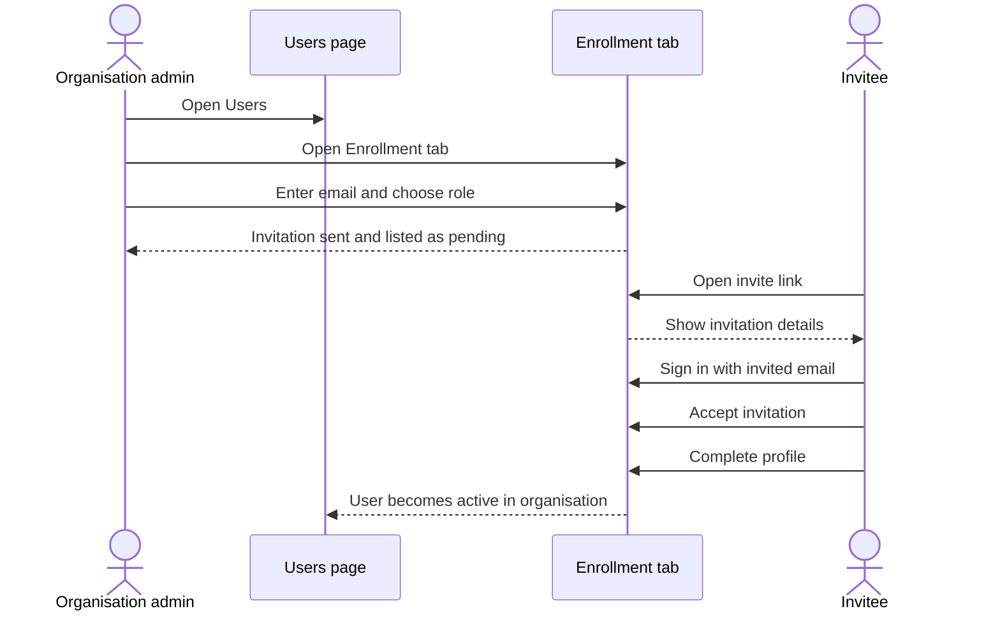

# Users

Users are the people who sign in to Odock. They receive an organisation role, can belong to teams, can own user-scoped virtual API keys, and appear in usage and cost views when their credentials or ownership scopes are involved.

## Concept

A user record answers four questions:

- Who is this person?
- Which organisation do they belong to?
- What role do they have in that organisation?
- Which teams, keys, usage records, budgets, and quotas are related to them?

A user can belong to multiple teams. Team membership is separate from the organisation role. For example, a person can be a manager for one team and a regular member of another team.

## Organisation-Facing Roles

Odock uses roles to decide what a signed-in person can see and change in the UI.

| Role | Use it when | In the UI, this usually means |
| --- | --- | --- |
| Organisation Admin | The person is responsible for the whole organisation workspace | They can manage organisation users, teams, settings, credentials, budgets, quotas, access, and usage review |
| Manager | The person is responsible for assigned teams | They can work in team-scoped areas and review the people and resources connected to their teams |
| User | The person needs governed access but should not manage the workspace | They can use permitted self-service and visibility workflows |

Avoid giving broad roles just to make a one-off task easier. Prefer team membership, team-scoped API keys, and scoped budgets or quotas when the work belongs to a specific group.

## User Status

| Status | Meaning | Typical action |
| --- | --- | --- |
| `PENDING` | The user has not completed activation or is waiting for approval | Review the account or guide the user through enrollment |
| `ACTIVE` | The user can use the UI according to their role and scope | Keep memberships and ownership current |
| `REVOKED` | The user should no longer use the organisation workspace | Review owned keys, teams, budgets, and quotas |

Revoking a user is not the same as reviewing runtime API keys. If a user owns keys or belongs to teams with active keys, review those credentials separately in [Virtual API Keys](/docs/management/virtual-api-keys).

## Enrollment Flow

The recommended onboarding path is invitation-based enrollment from the **Users** page. It gives the organisation a clear record of who was invited, which role was assigned, and whether the invitation is pending, accepted, expired, or revoked.

## Users Page

Open **Users** in the organisation sidebar. The page has two tabs:

- **Users Table**: review existing users, filter by role or status, open user details, and approve or decline pending users when available.
- **Enrollment**: invite users, track invitations, refresh invitation status, resend pending invitations, and revoke invitations when needed.

## User Detail Page

Open a user from the table to review the full user-management context.

The user detail page shows:

- Profile fields: ID, name, email, role, status, organisation, created date, updated date.
- **Teams**: teams this user belongs to.
- **API Keys**: user-scoped virtual API keys owned by this user.
- **Usage Records**: gateway activity attributed to the user.
- **Budgets**: budgets owned by this user.
- **Quotas**: quotas owned by this user.

## Tutorials

- [Invite a user](/docs/user-management/users/invite-user)
- [Accept an invitation](/docs/user-management/users/accept-invitation)
- [Resend an invitation](/docs/user-management/users/resend-invitation)
- [Revoke an invitation](/docs/user-management/users/revoke-invitation)
- [Review users](/docs/user-management/users/review-users)
- [Approve or decline a pending user](/docs/user-management/users/approve-decline-pending-user)
- [Add a new user](/docs/user-management/users/add-new-user)
- [Edit a user](/docs/user-management/users/edit-user)
- [Add a user to a team](/docs/user-management/users/add-user-to-team)
- [Review user-owned API keys](/docs/user-management/users/review-user-api-keys)
- [Review user usage, budgets, and quotas](/docs/user-management/users/review-user-usage-budgets-quotas)

## Practical Guidance

- Prefer invitation enrollment for normal onboarding.
- Keep organisation-admin access limited to people who operate the whole workspace.
- Use teams to represent ownership groups, not just mailing lists.
- Use manager membership for team responsibility.
- Review user-owned API keys when a user changes role or leaves.
- Review budgets and quotas whenever a user starts a new high-volume workflow.
- Use usage records to validate whether access is actually being used.
